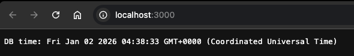

# docker-node-postgres

Production-ready Docker Compose stack with a Node.js API and PostgreSQL database.  
This project demonstrates **containerization best practices**, **service networking**, and a **CI-ready Docker workflow**.

---

## 🧱 Architecture

- **Node.js API**
  - Simple HTTP server
  - Connects to PostgreSQL using environment variables
- **PostgreSQL**
  - Runs as a separate service
  - Not exposed to the host
- **Docker Compose**
  - Orchestrates services
  - Provides internal networking via service names
- **GitHub Actions**
  - Builds Docker images on every push to `main`

---

## 📁 Project Structure

```text
.
├── Dockerfile
├── docker-compose.yml
├── server.js
├── package.json
├── package-lock.json
└── .github/
    └── workflows/
        └── docker-ci.yml
```

## 🚀 Getting Started (Local)

### Prerequisites
- Docker
- Docker Compose

### Run the stack
```bash
docker compose up --build
curl localhost:3000
```

### Expected output:



## 🧠 Key Concepts Demonstrated

## Dockerfile Best Practices
- Small base image (`node:alpine`)
- Layer caching
- `.dockerignore`

## Docker Compose
- Multi-container application
- Internal DNS via service names
- Environment-based configuration

## Data Separation
- Stateless API container
- Persistent database service

## CI with GitHub Actions
- Clean, reproducible Docker builds
- Immutable image tagging using commit SHA

## 🔄 CI Pipeline

On every push to `main`, GitHub Actions:

- Checks out the repository
- Builds the Docker image in a clean environment
- Tags the image with the commit SHA

This prevents “works on my machine” issues and ensures build reproducibility.

## 🛑 Notes

- PostgreSQL is not exposed to the host (internal access only)
- This project focuses on local development and CI
- Deployment to cloud platforms (ECS/ECR) is intentionally out of scope

## 👤 Author

Saliou
Cloud Engineer — Docker • AWS • CI/CD